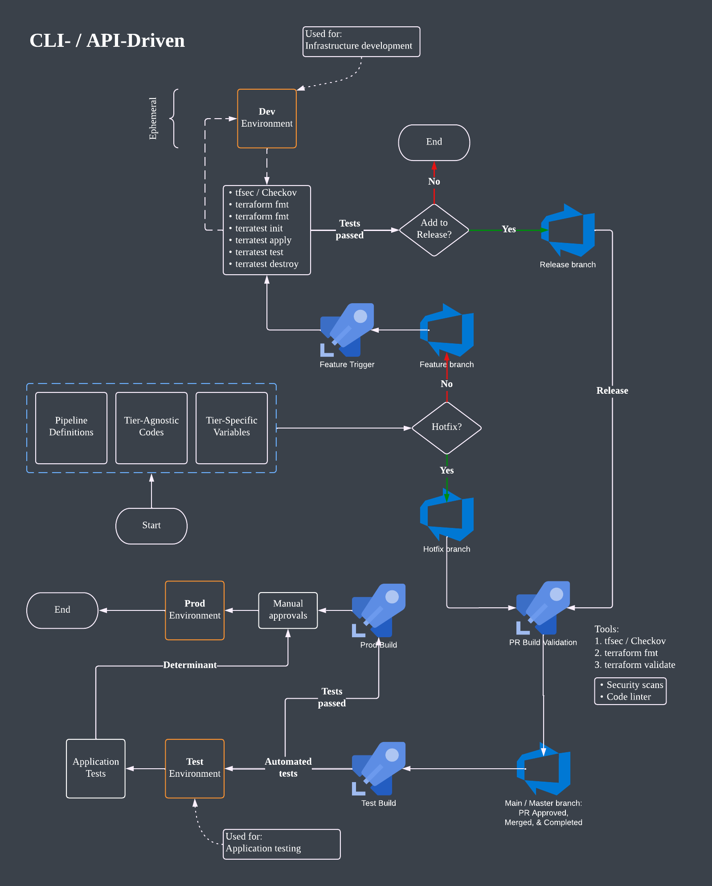
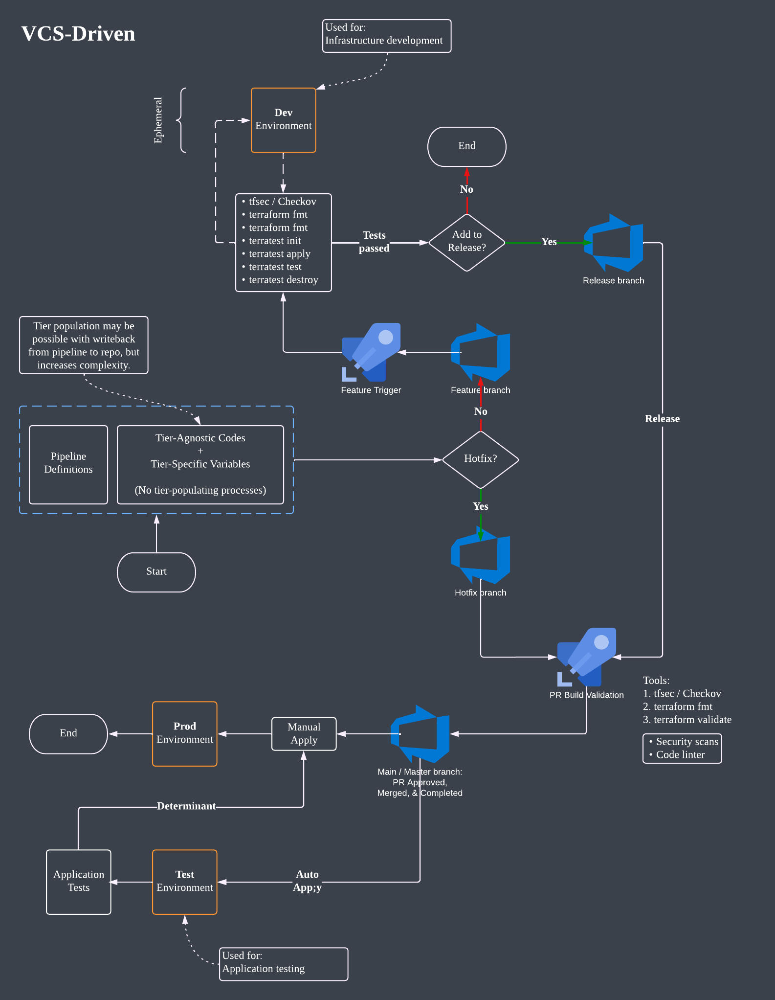

# terraform-tier-promotion

## Features

- Trunk-based
- Optionally ephemeral Dev resources for infrastructure development
- Release and Hotfix branches
- Automated testing
- Possible application testing
- Manual approval to Prod

## Workflow Diagrams

- 
- 
